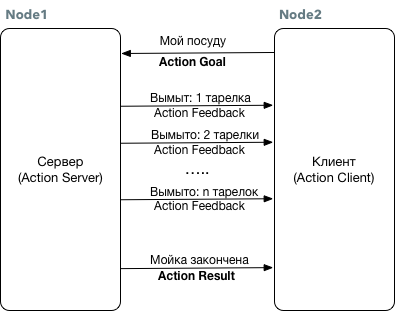

# Работа с Action

Модель коммуникации в режиме Действие \(Action\) используется когда выполнение запрошенной команды занимает продолжительное время, и необходима обратная связь с процессом. Это очень похоже на модель Service: \(Service Request\) используется как Задача \(Action Goal\) а ответ \(Service Response\) используеться как Результат \(Action Result\). Также есть дополнительная сущность Обратная Связь \(Action Feedback\), для передачи промежуточных результатов для клиента. 



Например, как показано на рисунке, если клиент устанавливает цель -- мыть посуду, сервер информирует клиента о ходе мытья посуды форме обратной связи, и в после окончания обработки,  отправляет клиенту сообщение об окончании процесса. 

В отличие от службы \(Service\), действие \(Action\) часто используется для управления сложными задачами робота, такими как передвижение к заданной точке, запуск лазерного сканирования и т.п.

#### Файл описания действия \(Action\) .action

Файлы описания действия \(Action\) находяться в директории `./action` пакета имеют расширение `.action`, и выгледят приблизительно так:

```text
# Определение цели (goal)
uint32 dishes  # Сколько мыть тарелок
---
# Определение результата (result)
uint32 total_dishes_cleaned # Сколько всего было вымыто
---
# Определение обратной связи (feedback)
uint32 dishes_cleaned # Сколько вымыто посуды сейча
```

На основе этого файла .action создаются 6 вспомогательных сообщений, чтобы клиент и сервер могли общаться. Это преобразование может автоматически запускаться во время процесса make.

Для файла `DoDishes.action` будут созданны  файлы

```text
DoDishesAction.msg
DoDishesActionGoal.msg
DoDishesActionResult.msg
DoDishesActionFeedback.msg
DoDishesGoal.msg
DoDishesResult.msg
DoDishesFeedback.msg
```

### Примеры работы на Python

Для файла DoDishes.action простой клиент для пакета ros\_book\_demo

```python
#! /usr/bin/env python

import roslib
import rospy
import actionlib

from ros_book_demo.msg import DoDishesAction, DoDishesResult, DoDishesFeedback

class DoDishesServer:
  _feedback = DoDishesFeedback()
  _result = DoDishesResult()
  def __init__(self):
    self.clear_dishes = 0
    self.server = actionlib.SimpleActionServer('do_dishes', DoDishesAction, self.execute, False)
    self.server.start()

  def execute(self, goal):
    r = rospy.Rate(1)
    self._feedback.sequence = []
    # Do lots of awesome groundbreaking robot stuff here
    for i in range(1, goal.dishes):
      self.server.publish_feedback(DoDishesFeedback(i)) #отправим текущее значение
      self.clear_dishes+=1 #Увеличим общий результат
      r.sleep() #Отправляем данные 1 раз в секунду
      
    self._result.sequence = self._feedback.sequence
    self.server.set_succeeded(DoDishesResult(self.clear_dishes))


if __name__ == '__main__':
  rospy.init_node('do_dishes_server')
  server = DoDishesServer()
  rospy.spin()
```

